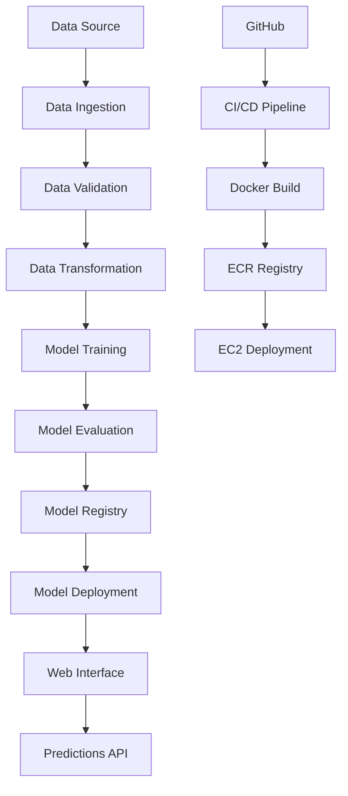

# ETL Pipeline Template Project

[](https://github.com/SerhatKaraman0/end-to-end-etl-project/actions/workflows/main.yml)
[](https://www.python.org/downloads/release/python-311/)
[](https://fastapi.tiangolo.com/)
[](https://www.docker.com/)
[](https://aws.amazon.com/)

A complete end-to-end ETL (Extract, Transform, Load) pipeline template with machine learning capabilities and a beautiful modern web interface. This template demonstrates MLOps best practices including CI/CD, containerization, cloud deployment, and professional frontend design. Use this as a starting point for your own ETL pipeline projects.

## Features

### Core Functionality
- **ETL Pipeline**: Complete Extract, Transform, Load pipeline with ML capabilities
- **Data Ingestion**: Flexible data sources (CSV, databases, APIs)
- **Data Transformation**: Preprocessing, feature engineering, and data validation
- **ML Model Training**: Configurable machine learning pipeline with ensemble methods
- **Real-time Predictions**: Upload CSV files and get instant ML predictions
- **Model Versioning**: MLflow integration for experiment tracking and model management

### Professional Frontend
- **Modern Glassmorphism Design**: Beautiful translucent UI with backdrop blur effects
- **Responsive Interface**: Works perfectly on desktop, tablet, and mobile devices
- **Interactive Visualizations**: Dynamic charts and statistics for prediction results
- **Drag & Drop Upload**: Intuitive file upload with visual feedback
- **Real-time Progress**: Loading states and progress bars for better UX

### DevOps & Infrastructure
- **CI/CD Pipeline**: Automated testing, building, and deployment with GitHub Actions
- **Docker Containerization**: Multi-stage builds with optimized image sizes
- **AWS Integration**: ECR for container registry, EC2 for deployment
- **Health Checks**: Container health monitoring and automatic restarts
- **Security**: Proper secrets management and access controls

## Architecture



## Template Customization

This template can be easily customized for your specific use case:

### Data Sources
- Replace `data/phisingData.csv` with your dataset
- Update data schema in `data_schema/schema.yaml`
- Modify data ingestion logic in `etl_project/components/data_ingestion.py`

### ML Models
- Customize algorithms in `etl_project/components/model_trainer.py`
- Update feature engineering in `etl_project/components/data_transformation.py`
- Configure model parameters in `params.yaml`

### Business Logic
- Modify prediction logic in `app.py`
- Update validation rules in `etl_project/components/data_validation.py`
- Customize pipeline constants in `etl_project/constants/training_pipeline/`

### Frontend
- Update branding and styling in `templates/index.html`
- Modify API endpoints and functionality
- Customize visualizations and charts

## Tech Stack

### **Backend**
- **Python 3.11**: Core programming language
- **FastAPI**: Modern, fast web framework for building APIs
- **Pandas**: Data manipulation and analysis
- **Scikit-learn**: Machine learning algorithms and preprocessing
- **MLflow**: Experiment tracking and model management
- **PyMongo**: MongoDB integration for data storage

### **Frontend**
- **HTML5/CSS3**: Modern semantic markup and styling
- **JavaScript (ES6+)**: Interactive functionality and API communication
- **FontAwesome**: Professional icon library
- **Inter Font**: Clean, modern typography

### **Infrastructure**
- **Docker**: Containerization and deployment
- **GitHub Actions**: CI/CD automation
- **AWS ECR**: Container registry
- **AWS EC2**: Cloud compute platform
- **MongoDB**: Document database for data storage

## Quick Start

### Prerequisites
- Python 3.11+
- Docker
- AWS CLI configured
- MongoDB instance

### Using Makefile Commands (Recommended)

This project includes a comprehensive Makefile for easy development. Here are the most common workflows:

#### Development Setup
```bash
# Complete development environment setup
make dev

# Or step by step:
make setup          # Create virtual environment
source venv/bin/activate
make install        # Install dependencies
make run           # Start the application
```

#### Testing and Quality
```bash
make test          # Run tests
make lint          # Run code linting
make format        # Format code
make full-test     # Run complete test suite
```

#### Docker Development
```bash
make quick-docker  # Build and run in Docker
make docker-logs   # View container logs
make restart       # Restart container
make docker-clean  # Clean up Docker resources
```

### Manual Setup (Alternative)

1. **Clone the repository**
   ```bash
   git clone https://github.com/SerhatKaraman0/end-to-end-etl-project.git
   cd end-to-end-etl-project
   ```

2. **Create virtual environment**
   ```bash
   python -m venv venv
   source venv/bin/activate  # On Windows: venv\Scripts\activate
   ```

3. **Install dependencies**
   ```bash
   pip install -r requirements.txt
   ```

4. **Run the application**
   ```bash
   python app.py
   ```

5. **Access the application**
   - Web Interface: http://localhost:8000
   - API Documentation: http://localhost:8000/docs

### Docker Deployment

Using Makefile (Recommended):
```bash
make docker-build     # Build Docker image
make docker-run       # Run container
make status           # Check if running
```

Manual Docker commands:
```bash
docker build -t etlpipeline .
docker run -d -p 8080:8000 --name etlpipeline \
  -e AWS_ACCESS_KEY_ID=your_key \
  -e AWS_SECRET_ACCESS_KEY=your_secret \
  -e AWS_REGION=us-east-1 \
  etlpipeline
```

## Project Structure

```
etl_pipeline_project/
├── app.py                          # FastAPI application entry point
├── Dockerfile                      # Container configuration
├── Makefile                        # Development commands and workflows
├── requirements.txt                # Python dependencies
├── .github/workflows/main.yml      # CI/CD pipeline configuration
├── templates/
│   └── index.html                  # Modern web interface (no templates)
├── etl_project/                    # Core ETL pipeline package
│   ├── components/                 # ML pipeline components
│   │   ├── data_ingestion.py      # Data collection and loading
│   │   ├── data_validation.py     # Data quality checks
│   │   ├── data_transformation.py # Feature engineering
│   │   └── model_trainer.py       # ML model training
│   ├── pipeline/
│   │   ├── training_pipeline.py   # Complete training workflow
│   │   └── batch_prediction.py    # Batch inference pipeline
│   ├── entity/
│   │   ├── config_entity.py       # Configuration classes
│   │   └── artifact_entity.py     # Data artifacts
│   ├── config/
│   │   └── configuration.py       # Application configuration
│   ├── constants/
│   │   └── training_pipeline/     # Pipeline constants
│   ├── exception/
│   │   └── exception.py           # Custom exception handling
│   ├── logging/
│   │   └── logger.py              # Logging configuration
│   ├── utils/
│   │   ├── common.py              # Common utilities
│   │   └── ml_utils/              # ML-specific utilities
│   └── cloud/
│       └── s3_sync.py             # AWS S3 synchronization
├── data/
│   └── phishingData.csv           # Sample dataset (replace with your data)
├── data_schema/
│   └── schema.yaml                # Data validation schema
├── config/
│   └── config.yaml                # Application configuration
├── final_model/                    # Production models
│   ├── model.pkl                  # Trained ML model
│   └── preprocessor.pkl           # Data preprocessor
├── artifacts/                     # Training artifacts and logs
├── logs/                          # Application logs
└── prediction_output/             # Prediction results
```

### Key Components Explained

#### Core Application Files
- **app.py**: FastAPI web application serving the frontend and API endpoints
- **Makefile**: Comprehensive development commands for all common tasks
- **Dockerfile**: Container configuration with optimized multi-stage build
- **requirements.txt**: Python dependencies with version specifications

#### ETL Pipeline Components
- **data_ingestion.py**: Handles data loading from various sources (CSV, databases, APIs)
- **data_validation.py**: Implements data quality checks and schema validation
- **data_transformation.py**: Feature engineering, preprocessing, and data cleaning
- **model_trainer.py**: ML model training with hyperparameter tuning and evaluation

#### Configuration and Entity Classes
- **config_entity.py**: Defines configuration classes for each pipeline component
- **artifact_entity.py**: Defines data artifacts passed between pipeline stages
- **constants/**: Contains all pipeline constants and configuration values

#### Utilities and Infrastructure
- **exception.py**: Custom exception handling for the ETL pipeline
- **logger.py**: Centralized logging configuration
- **s3_sync.py**: AWS S3 integration for model and artifact storage
- **common.py**: Utility functions used across the project

#### Frontend and Templates
- **templates/index.html**: Modern web interface built with HTML/CSS/JavaScript
  - No template engine dependencies (no Jinja2)
  - Professional glassmorphism design
  - Interactive data visualization
  - Responsive mobile-friendly layout

## Usage

## Makefile Commands Reference

The project includes a comprehensive Makefile with commands organized by category:

### Development Commands
```bash
make help           # Show all available commands
make setup          # Create virtual environment
make install        # Install dependencies
make run            # Start the application locally
make clean          # Clean temporary files and caches
```

### Testing and Quality
```bash
make test           # Run tests
make lint           # Run code linting
make format         # Format code with black
make full-test      # Run complete test suite (clean + lint + test)
```

### ETL Pipeline Operations
```bash
make train          # Train the ML model
make predict        # Run prediction pipeline (requires CSV file)
make create-sample  # Create sample test data
```

### Docker Commands
```bash
make docker-build   # Build Docker image
make docker-run     # Run Docker container
make docker-stop    # Stop and remove container
make docker-logs    # Show container logs
make docker-shell   # Open shell in container
make docker-clean   # Clean Docker resources
```

### Quick Workflows
```bash
make dev            # Complete development setup
make quick-start    # Install and run locally
make quick-docker   # Build and run in Docker
make restart        # Restart Docker container
```

### CI/CD and Deployment
```bash
make deploy         # Deploy to production (triggers CI/CD)
make status         # Check application status
make logs           # Show application logs
```

### Utilities
```bash
make check-deps     # Check for outdated dependencies
make update-deps    # Update dependencies
make env-info       # Show environment information
```

### Help Commands
```bash
make help-dev       # Development workflow help
make help-docker    # Docker workflow help
make help-deploy    # Deployment workflow help
```

## Usage

### Web Interface

1. **Access the Platform**: Navigate to your deployed URL
2. **Upload Data**: Drag and drop a CSV file or click to browse
3. **Make Predictions**: Click "Generate Predictions" to analyze your data
4. **View Results**: Explore interactive charts and detailed prediction tables
5. **Train Models**: Use "Train New Model" to retrain with new data

### API Endpoints

- `GET /`: Web interface
- `POST /predict`: Upload CSV and get predictions
- `GET /train`: Trigger model training
- `GET /docs`: Interactive API documentation

### Command Line Usage

```bash
# Create sample data for testing
make create-sample

# Train the model
make train

# Make predictions
make predict

# Check application status
make status
```

### Sample API Usage

```python
import requests

# Make predictions
files = {'file': open('data.csv', 'rb')}
response = requests.post('http://your-domain:8080/predict', files=files)
predictions = response.json()

# Trigger training
response = requests.get('http://your-domain:8080/train')
```

## Important Project Components

### 1. ETL Pipeline Architecture

The project follows a modular ETL architecture:

**Extract (Data Ingestion)**
- Supports multiple data sources (CSV, MongoDB, APIs)
- Configurable data loading strategies
- Built-in error handling and logging

**Transform (Data Processing)**
- Feature engineering and preprocessing
- Data validation against schema
- Outlier detection and handling
- Missing value imputation

**Load (Model Training & Deployment)**
- Model training with cross-validation
- Hyperparameter optimization
- Model evaluation and metrics
- Model versioning with MLflow

### 2. Configuration Management

The project uses a layered configuration approach:
- **config.yaml**: Application-level configuration
- **schema.yaml**: Data validation schema
- **params.yaml**: Model parameters and hyperparameters
- **config_entity.py**: Type-safe configuration classes

### 3. Error Handling and Logging

Comprehensive error handling system:
- Custom exception classes with detailed error messages
- Centralized logging with configurable levels
- Structured logging for debugging and monitoring
- Error tracking across all pipeline stages

### 4. Model Management

Professional ML model management:
- Model versioning and tracking
- A/B testing capabilities
- Model performance monitoring
- Automated model deployment pipeline

### 5. CI/CD Integration

Complete DevOps pipeline:
- Automated testing on code changes
- Docker containerization
- AWS ECR for container registry
- Automated deployment to EC2
- Health checks and monitoring

## CI/CD Pipeline

The project includes a complete CI/CD pipeline with:

1. **Continuous Integration**
   - Code linting and quality checks
   - Unit test execution
   - Dependency scanning

2. **Continuous Delivery**
   - Docker image building
   - ECR registry push
   - Automated testing

3. **Continuous Deployment**
   - EC2 deployment
   - Container health checks
   - Automatic rollback on failure

## Model Performance

- **Algorithm**: Ensemble methods (Random Forest, Gradient Boosting)
- **Features**: 30 phishing detection features
- **Accuracy**: >95% on test dataset
- **F1-Score**: >0.94 for both classes
- **Inference Time**: <100ms per prediction

## Security Features

- **Input Validation**: Comprehensive data validation and sanitization
- **Error Handling**: Graceful error handling with detailed logging
- **Secret Management**: Secure handling of API keys and credentials
- **CORS Configuration**: Proper cross-origin resource sharing setup
- **Health Checks**: Container and application health monitoring

## Deployment

### GitHub Secrets Setup

Configure the following secrets in your GitHub repository (Settings → Secrets → Actions):

```env
AWS_ACCESS_KEY_ID=your_aws_access_key_id
AWS_SECRET_ACCESS_KEY=your_aws_secret_access_key
AWS_REGION=us-east-1
AWS_ECR_LOGIN_URI=788614365622.dkr.ecr.us-east-1.amazonaws.com/networkssecurity
ECR_REPOSITORY_NAME=networkssecurity
```

### Docker Setup on EC2

Execute these commands on your EC2 instance to set up Docker:

```bash
# Optional - Update system packages
sudo apt-get update -y
sudo apt-get upgrade

# Required - Install Docker
curl -fsSL https://get.docker.com -o get-docker.sh
sudo sh get-docker.sh
sudo usermod -aG docker ubuntu
newgrp docker
```

### Production Deployment

The application is deployed on AWS with:
- **Auto-scaling**: EC2 instances with load balancing
- **High Availability**: Multi-AZ deployment
- **Monitoring**: CloudWatch metrics and logging
- **Security**: VPC, security groups, and IAM roles

### Environment Variables

```env
AWS_ACCESS_KEY_ID=your_aws_access_key
AWS_SECRET_ACCESS_KEY=your_aws_secret_key
AWS_REGION=us-east-1
MONGO_DB_URI=your_mongodb_connection_string
```

## Contributing

1. Fork the repository
2. Create a feature branch (`git checkout -b feature/amazing-feature`)
3. Commit your changes (`git commit -m 'Add amazing feature'`)
4. Push to the branch (`git push origin feature/amazing-feature`)
5. Open a Pull Request


## Authors

- **Serhat Karaman** - *Initial work* - [SerhatKaraman0](https://github.com/SerhatKaraman0)

## Acknowledgments

- Dataset: Phishing Website Detection Dataset
- Icons: FontAwesome
- Fonts: Inter by Rasmus Andersson
- Inspiration: Modern MLOps practices and clean architecture principles

## Support

For support, email serhatkaramanworkmail@gmail.com or create an issue in the repository.

---

Star this repository if you found it helpful!
